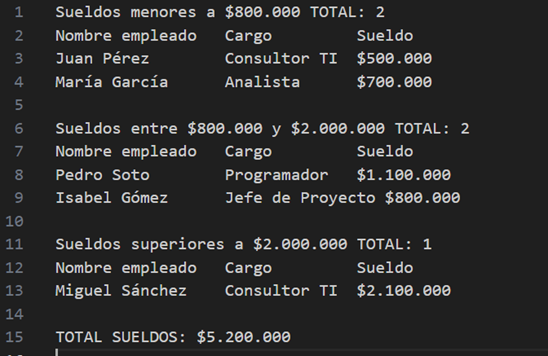
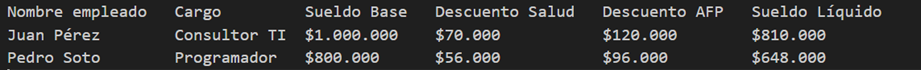
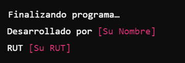

Esta es una evaluación que corresponde a una ejecución práctica y tiene un 40% de ponderación sobre la nota final de la asignatura. El tiempo para desarrollar esta evaluación es de 5 horas pedagicas y se realiza de manera individual en laboratorio La evaluación consiste en: Desarrollar una aplicación en Python utilizando los conceptos de programación desarrollados durante la asignatura: 

•	Estructuras de entrada y salida 
•	Estructuras de decisión 
•	Estructuras de repetición 
•	Colecciones 
•	Funciones 
•	Manejo de archivos 
•	Uso de github como repositorio de código 

Preste atención en la rúbrica, donde se señala explícitamente que de haber errores de sintaxis no obtendrá puntaje en ningún ítem

Una empresa llamada Planing Solutions necesita analizar los datos de sus trabajadores para generar algunos reportes. Usted ha sido contratado para desarrollar un prototipo en Python que cumpla con los siguientes requerimientos:
La aplicación debe permitir analizar los sueldos de 10 empleados, cuyos nombres y cargos están previamente definidos y cuyos sueldos se generarán aleatoriamente entre $300.000 y $2.500.000. La lista de empleados es la siguiente:

```python
trabajadores = [
    {"nombre": "Juan Pérez", "cargo": "Consultor TI"},
    {"nombre": "María García", "cargo": "Analista"},
    {"nombre": "Carlos López", "cargo": "Programador"},
    {"nombre": "Ana Martínez", "cargo": "Jefe de Proyecto"},
    {"nombre": "Pedro Rodríguez", "cargo": "Consultor TI"},
    {"nombre": "Laura Hernández", "cargo": "Analista"},
    {"nombre": "Miguel Sánchez", "cargo": "Programador"},
    {"nombre": "Isabel Gómez", "cargo": "Jefe de Proyecto"},
    {"nombre": "Francisco Díaz", "cargo": "Consultor TI"},
    {"nombre": "Elena Fernández", "cargo": "Analista"}
]
```

Requerimientos del Prototipo
La aplicación deberá tener un menú con las siguientes funcionalidades:
1.	Asignar sueldos aleatorios
2.	Clasificar sueldos
3.	Ver estadísticas
4.	Generar reporte de sueldos
5.	Salir del programa

1. **Asignar sueldos aleatorios**
Desarrolle una función que genere sueldos aleatorios para los 10 empleados. Esta función será utilizada para inicializar los datos necesarios para la ejecución del programa.

2. **Clasificar sueldos**
Desarrolle una función que muestre la lista de empleados con su respectivo sueldo y clasificación según el siguiente esquema:

•	Sueldos menores a $800.000
•	Sueldos entre $800.000 y $2.000.000
•	Sueldos superiores a $2.000.000

El formato de salida debe ser similar al siguiente ejemplo:


3. **Ver estadísticas**
Desarrolle una función que muestre por pantalla los siguientes datos con respecto a los sueldos:
•	Sueldo más alto
•	Sueldo más bajo
•	Promedio de sueldos
•	Media geométrica de sueldos

4. **Generar reporte de sueldos**
Desarrolle una función que muestre el detalle de los sueldos de los trabajadores, aplicando las siguientes reglas de negocio:

•	Descuento salud: 7%
•	Descuento AFP: 12%
•	Sueldo líquido: calculado en base al sueldo base menos el descuento en salud y menos el descuento AFP.
El formato de salida debe ser similar al siguiente ejemplo y debe ser exportado a un archivo CSV:


5. Salir del programa
La aplicación deberá finalizar mostrando un mensaje de salida con sus datos. El mensaje debe ser similar al siguiente:
 
